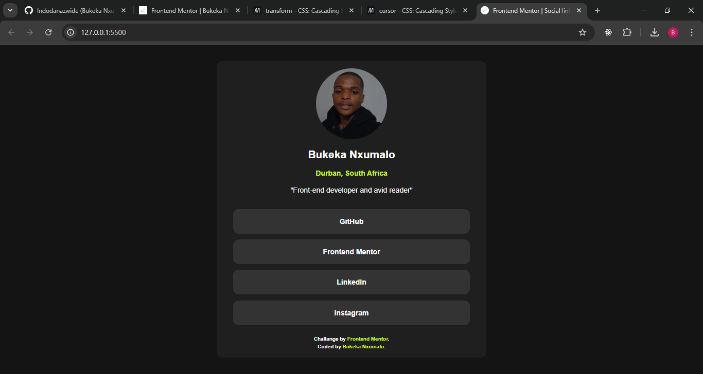

# Frontend Mentor - Social links profile solution

This is a solution to the [Social links profile challenge on Frontend Mentor](https://www.frontendmentor.io/challenges/social-links-profile-UG32l9m6dQ). Frontend Mentor challenges help you improve your coding skills by building realistic projects. 

## Table of contents

- [Overview](#overview)
  - [The challenge](#the-challenge)
  - [Screenshot](#screenshot)
  - [Links](#links)
- [My process](#my-process)
  - [Built with](#built-with)
  - [What I learned](#what-i-learned)
  - [Continued development](#continued-development)
  - [Useful resources](#useful-resources)
- [Author](#author)
- [Acknowledgments](#acknowledgments)

## Overview

### The challenge

Users should be able to:

- See hover and focus states for all interactive elements on the page

### Screenshot

### Links

- Solution URL: [Add solution URL here](https://your-solution-url.com)
- Live Site URL: [Add live site URL here](https://your-live-site-url.com)

## My process

### Built with

- Semantic HTML5 markup
- CSS custom properties
- Flexbox

### What I learned

1️⃣ Properly structuring HTML lists: I learned that <a> tags should go inside <li> instead of wrapping around them for valid HTML.

2️⃣ CSS hover effects: Using hover on both <li> and <a> improves the user experience.

3️⃣ Responsive design best practices: Using max-width on images prevents layout breaking on different screen sizes.

4️⃣ Accessibility improvements: Ensuring links are properly structured enhances usability for screen readers.

### Continued development

As I move forward with more projects, I want to focus on improving the following areas:

1️⃣ Accessibility (a11y) – Ensuring all interactive elements are properly structured for screen readers and keyboard navigation. I plan to research ARIA attributes and semantic HTML best practices to make my projects more inclusive.

2️⃣ Responsive Design – While I applied mobile-first principles in this project, I want to dive deeper into CSS media queries, flexbox vs. grid, and using clamp() and minmax() for better fluid layouts.

3️⃣ Reusable Components – As I transition to frameworks like React, I want to build UI components that are modular and scalable for future projects.

4️⃣ CSS Animations & Microinteractions – Adding subtle hover effects, transitions, and animations using keyframes, GSAP, or Framer Motion to enhance user experience.

5️⃣ JavaScript for Interactivity – Right now, my project is static, but in future projects, I want to use JavaScript to handle dynamic content, such as form validation, API fetching, or dark mode toggles.

6️⃣ Performance Optimization – Exploring lazy loading, image optimization, and CSS/JS minification to improve page load speeds.

### Useful resources

1️⃣ [MDN Web Docs](https://developer.mozilla.org/) - My go-to resource for learning HTML, CSS, and JavaScript. It provides well-documented guides, examples, and references.

2️⃣ [ChatGPT](https://chat.openai.com/) - Used for code reviews, debugging, and getting explanations on tricky concepts. Helped me refine my code and improve structure.

## Author

- GitHub - [Bukeka Nxumalo](https://github.com/Indodanazwide)
- Frontend Mentor - [@Indodanazwide](https://www.frontendmentor.io/profile/Indodanazwide)

## Acknowledgments

I’d like to give a huge thanks to Frontend Mentor for providing this challenge, which helped me improve my HTML, CSS, and responsive design skills.

A special shout-out to MDN Web Docs for being an amazing learning resource and ChatGPT for assisting with code reviews and debugging.

I also want to acknowledge the Frontend Mentor community and other developers who have shared their solutions—seeing different approaches has been really insightful!